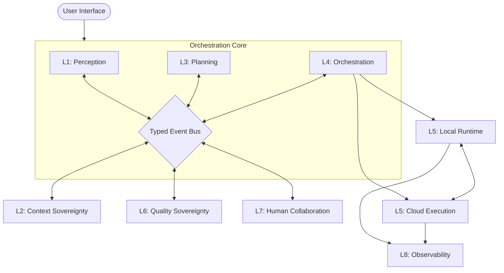

# APEX: Adaptive Parallel Execution Agent

## Project Overview

APEX (Adaptive Parallel Execution Agent) is an architectural framework designed for autonomous high-fidelity software engineering. It operates on a 9-layer stack that separates intezlligence substrate, perception, context, planning, orchestration, execution, quality, human collaboration, and observability.

This directory (`apex/`) contains the implementable decomposition of the original `APEX.md` vision document. Every file in this directory has been audited for feasibility and categorized according to the [Decomposition Guide](../decomposition_guide.md).

---

## Navigation Index

### Tier 1: Foundation
- [GLOSSARY.md](./GLOSSARY.md): Canonical term definitions.
- [NON_GOALS.md](./NON_GOALS.md): Explicit exclusions for v1.0.
- [PHASING.md](./PHASING.md): MVP roadmap (Phase 1 → 2 → 3).

### Tier 2: Layer Specifications
- [L0: Intelligence Substrate](./layers/L0_intelligence_substrate.md)
- [L1: Perception Engine](./layers/L1_perception_engine.md)
- [L2: Context Sovereignty](./layers/L2_context_sovereignty.md)
- [L3: Planning Intelligence](./layers/L3_planning_intelligence.md)
- [L4: Agent Orchestration](./layers/L4_agent_orchestration.md)
- [L5: Execution Environment](./layers/L5_execution_environment.md)
- [L6: Quality Sovereignty](./layers/L6_quality_sovereignty.md)
- [L7: Human Collaboration](./layers/L7_human_collaboration.md)
- [L8: Observability](./layers/L8_observability.md)

### Tier 3: Cross-Cutting
- [Event Bus Schema](./interfaces/event_bus_schema.md)
- [Layer Contracts](./interfaces/layer_contracts.md)
- [Tool Manifest](./interfaces/tool_manifest.md)
- [Agent Fleet](./agents/agent_fleet.md)

### Tier 4: Flows
- [Happy Path](./flows/happy_path.md)
- [Self-Healing Flow](./flows/self_healing_flow.md)
- [Parallel Execution Flow](./flows/parallel_execution_flow.md)

---

## Core Thesis Principles

| Principle | Status | Definition |
|---|---|---|
| **Omniscient Context** | ⚠️ **ASPIRATIONAL** | The agent maintains a full semantic understanding of the codebase and real-time developer intent. |
| **DAG-Native Execution** | ✅ **SPEC** | Tasks are nodes in a directed acyclic graph (DAG) with explicit dependencies and parallelism potential. |
| **Multi-Tier Quality Sovereignty** | ✅ **SPEC** | Every code artifact must pass through five independent quality tiers (Syntax, Semantic, Architectural, Security, Performance). |

---

## 9-Layer Architecture Stack

| Layer | Name | Primary Function |
|---|---|---|
| **L0** | Intelligence Substrate | Model routing (fast/balanced/deep) and constitutional reasoning. |
| **L1** | Perception Engine | Codebase ingestion (LSP/Graph) and real-time action streaming. |
| **L2** | Context Sovereignty | 5-layer weighted context assembly (C1-C5) and Brain storage. |
| **L3** | Planning Intelligence | Task decomposition into DAGs and risk scoring. |
| **L4** | Agent Orchestration | Multi-agent coordination via an asynchronous typed event bus. |
| **L5** | Execution Environment | Hybrid local/cloud VM execution within isolated sandboxes. |
| **L6** | Quality Sovereignty | 5-tier critic pipeline with self-healing failure diagnosis. |
| **L7** | Human Collaboration | Confidence-gated checkpoints and artifact review. |
| **L8** | Observability | Distributed tracing, cost tracking, and anomaly detection. |

---

## System Topology

