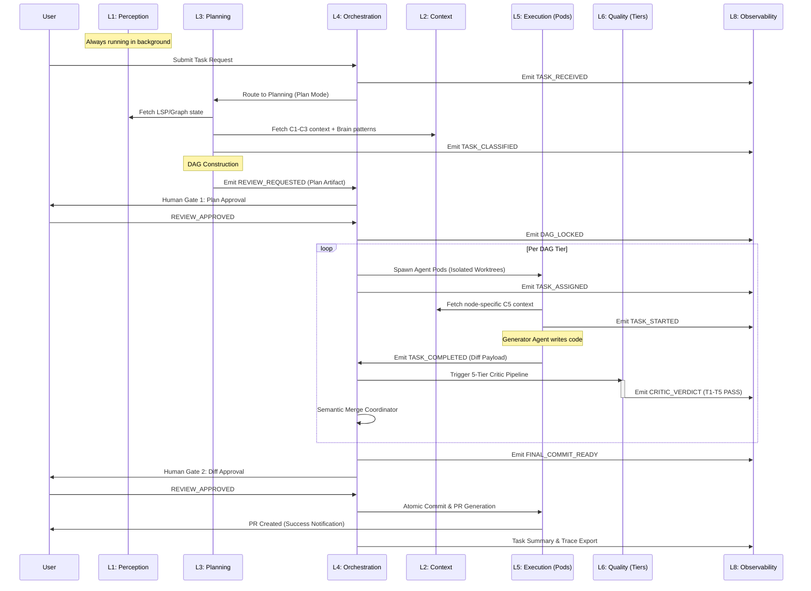

# Flow — Happy Path (End-to-End)

## Status
✅ **SPEC**

## Purpose
This flow traces a single developer request from initial intake to final commit, assuming a "happy path" with no agent failures, no quality tier rejections, and no human interventions beyond initial plan approval.

## Sequence Diagram

## Prose Walkthrough

### Phase 1: Intake & Intelligence (L1-L3)
1. **Request**: The user submits a request (e.g., "Add OAuth2 authentication"). The system emits `TASK_RECEIVED`.
2. **Analysis**: The **Intent Classifier (L3)** identifies the request as "Large/XL" and routes it to **Plan Mode**. It fetches the latest codebase state from the **Perception Engine (L1)** and relevant architectural constraints from the **APEX Brain (L2)**.
3. **Classification**: The request is tagged with metadata (e.g., "Feature", "High Complexity") and emits `TASK_CLASSIFIED`.

### Phase 2: Planning & Gate 1 (L3-L7)
1. **DAG Generation**: The **Architect Agent (L3)** decomposes the task into a Directed Acyclic Graph. Each node (T0, T1, etc.) is assigned a specialized agent, a risk score, and dependencies.
2. **Approval**: A **Plan Artifact** is generated and a `HUMAN_GATE_TRIGGERED` event (implicitly part of `REVIEW_REQUESTED`) stops execution. The user reviews and approves via `REVIEW_APPROVED`.
3. **Locking**: The DAG is finalized and the `DAG_LOCKED` event marks the transition to execution.

### Phase 3: Execution & Innovation (L4-L6)
1. **Parallel Spawning**: The **Orchestrator (L4)** identifies independent DAG nodes and spawns **Agent Pods (L5)**. Each pod receives a `TASK_ASSIGNED` event and initializes in a git worktree.
2. **Generation**: The **Generator Agent** in the pod writes the code, emitting `TASK_STARTED` upon commencement and `TASK_COMPLETED` with the resulting diff.
3. **Validation**: The **Critic Pipeline (L6)** runs all 5 quality tiers (Syntax, Semantic, Architectural, Security, Performance). In this happy path, each tier emits `CRITIC_VERDICT: PASS`.
4. **Integration**: Successful nodes are merged by the **Merge Coordinator (L4)**.

### Phase 4: Finalization (L7-L8)
1. **Commit Gate**: Once all DAG nodes are complete and integrated, a final integrated diff is presented to the user.
2. **Persistence**: Upon `REVIEW_APPROVED`, the **Commit Agent** creates a git commit and pushes a Pull Request.
3. **Cleanup**: The task trace is closed, metrics are exported to **Observability (L8)**, and the agent pods are destroyed.

## Data Artifacts Produced
- **Execution Graph**: The immutable JSON representation of the DAG.
- **Plan Artifact**: The human-readable Mermaid + Markdown document.
- **Trace Span**: A complete OpenTelemetry-compatible trace of all events.
- **Pull Request**: The final code contribution with auto-generated description.
