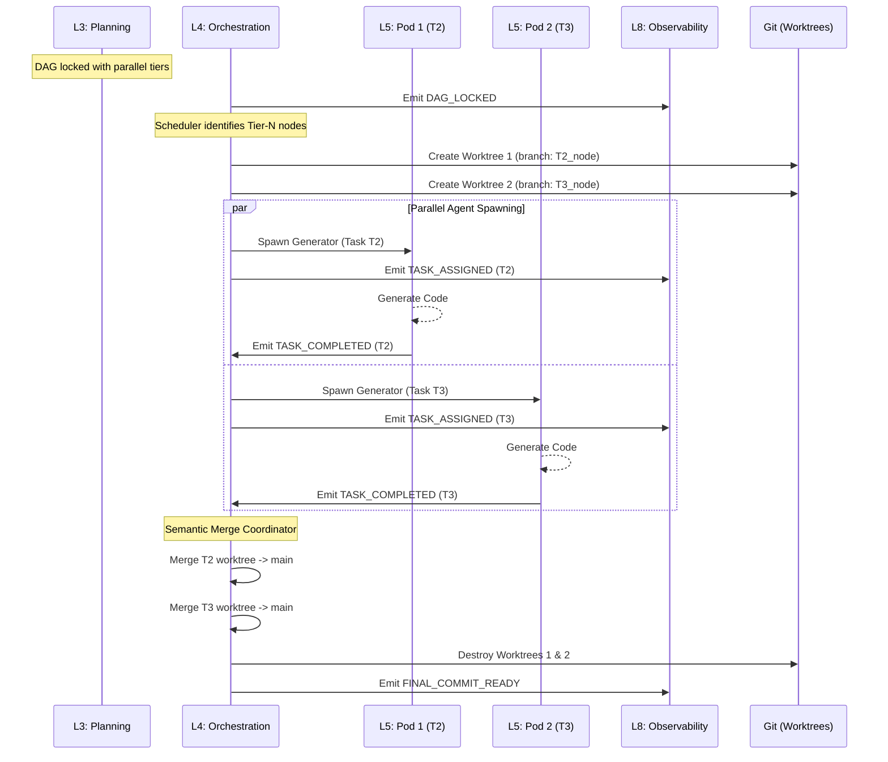

# Flow — Parallel Execution (DAG Tiers)

## Status
✅ **SPEC**

## Purpose
This flow outlines how the **Orchestrator (L4)** identifies and executes multiple independent tasks in parallel using **isolated git worktrees** and **ephemeral agent pods**. It details the **Coordination Protocol** used to merge results back into the repository without textual or semantic conflicts.

## Sequence Diagram

## Execution Protocol

### 1. Tier Identification & Scheduling
The **Orchestrator (L4)** performs a topological sort on the DAG locked by Planning (L3). It identifies nodes with no remaining dependencies and schedules them for parallel execution if:
- Their **Risk Score** is below the threshold (0.6).
- They target **Disjoint File Sets**.
- Current **Concurrency Quota (8)** is not exceeded.

### 2. Isolation (Git Worktrees)
For each parallel node, the system creates an ephemeral **Git Worktree**. This ensures:
- No file system contention (each agent operates on its own set of files).
- Independent compilation and testing within the pod.
- Atomic commit history for every subtask.

### 3. Merge Coordination (v1.0 - File-Level Isolation)
In the v1.0 specification, APEX avoids textual merge conflicts by enforcing **File-Level Isolation**:
- Two agents are **never** assigned to the same file simultaneously. 
- If the DAG dictates that two agents *must* edit the same file, the **Orchestrator** serializes their execution (Agent A completes → Merge → Agent B re-plans with Agent A's changes in context).

### 4. Semantic Merge (Phase 3 Path)
For v2.0/Phase 3, APEX moves toward **Semantic Merging**:
1. **Conflict Discovery**: Two agents modified different lines but affected the same AST function or API contract.
2. **Rejection**: The merge fails.
3. **Re-Planning**: The "losing" agent is re-triggered with the "winning" agent's diff as part of its **C5 Action context**. It adapts its code to the new reality.

## Concurrency & Quota Management
| Parameter | Default | Constraint |
|---|---|---|
| **Max Concurrent Pods** | 4 | System CPU/Memory dependent. |
| **Max Parallel Files** | 100 | File system descriptor limit per pod. |
| **Wait Timeout** | 5m | Pods that exceed timeout emit `TASK_FAILED`. |
| **Retry Slot** | 2 | Only 2 retries allowed before node becomes sequential. |

## Failure Handling (Parallel Context)
If one parallel node fails (L6 rejection) while others succeed:
1. The **Orchestrator** pauses the **Merge Coordinator** for the entire tier.
2. **Self-Healing** is triggered for the failing node.
3. Successful nodes remain in their worktrees until the tier is unified.
4. If a node is unrecoverable, the entire tier is rolled back to the previous DAG state and a `HUMAN_GATE_TRIGGERED` event is emitted.
