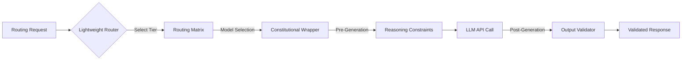

# Layer L0 — Intelligence Substrate

## Status
⚠️ **PARTIALLY SPECIFIED**
- SPEC sections: Model Routing Logic, Escalation Triggers, Static Routing Matrix.
- UNDERSPECIFIED sections: Constitutional Reasoning Layer (claims of model-level probability shifting are not validated), Model-Agnostic Tier Mapping, Latency Budgets.

## Purpose
Provides the foundational intelligence via model routing and output validation. It selects the optimal LLM for each agent operation and enforces reasoning constraints ("constitution") before and after inference.

## Inputs
- **Routing Request**: `(task_type, complexity, required_capability, language)` from any Agent Instance.
- **Critic Report**: `(pass/fail, failure_count)` from Layer L6 for escalation logic.

## Outputs
- **Inference Response**: Validated, structured output following constitutional constraints.
- **Routing Decision**: `(model_id, temperature, max_tokens)` used for span tracking in Layer L8.

## Internal Architecture

### Model Routing Decision (Static Matrix v1.0)
| Tier | Model Class (v1.0) | Default Task Assignment |
|---|---|---|
| **Fast** | Haiku-class | Intent classification, Git operations, PR descriptions. |
| **Balanced** | Sonnet-class | Code generation (Small/Medium), Tier 1-2 Critic checks. |
| **Deep** | Opus-class | Architectural planning, Tier 3-5 Critic checks, Self-healing. |

## Failure Modes
| Mode | Detection | Degradation | Recovery |
|---|---|---|---|
| **API Unavailability** | 503 HTTP or Timeout | No inference possible for specific tier. | Fall back to next available tier with lower/higher capability. |
| **Quality Degradation** | Pass rate drop in L8 | Increased self-healing loops. | Trigger model escalation (e.g., Sonnet → Opus) earlier. |
| **Constraint Violation** | Post-call validator | Potentially unsafe or hallucinated output. | Re-run inference with stricter constraints or escalate to human. |

## Resource Requirements
- **Compute**: Lightweight router (CPU-only).
- **External Services**: Anthropic/OpenAI/Gemini APIs.
- **LLM Calls**: 1 call per agent operation.
- **Cost**: Variable by model tier ($0.0001 - $0.10 per call).

## Dependencies
- Provider API keys (Anthropic default).
- Connectivity to external LLM endpoints.

## Phase Mapping
- **Phase 1 (MVP)**: Static routing only (Anthropic specific). No constitutional wrapping.
- **Phase 3 (Full)**: Adaptive routing and full Constitutional Reasoning Layer.

## Open Questions
- How are constitutional constraints injected without manual prompt pollution?
- What is the latency budget for the lightweight classifier vs the inference call itself?
- How do we handle provider outages via Multi-Cloud routing?
