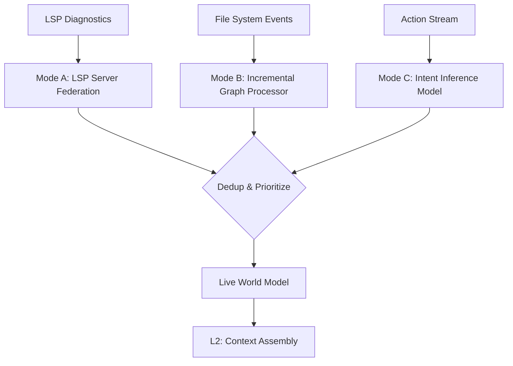

# Layer L1 — Perception Engine

## Status
⚠️ **PARTIALLY SPECIFIED**
- SPEC sections: Mode A (LSP Analysis), Mode B (Repo Graph), File System Event Processing.
- UNDERSPECIFIED sections: Mode C (Intent Inference from stream), Live World Model data structure.
- RESEARCH NEEDED: Real-time predictive intent from clipboard/navigation.

## Purpose
Continuous, non-demand codebase awareness. L1 builds and maintains the knowledge model of the repository state and the developer's current work context.

## Inputs
- **File System Events**: `inotify`/`fsevents` stream.
- **User Actions**: Terminal stdout, cursor position, navigation history, clipboard diffs.
- **LSP Diagnostics**: Type errors, symbol references.

## Outputs
- **World Model Update**: Delta update to the current context in L2.
- **Symbol Resolution**: Sub-100ms response to Architect/Generator Agent lookups.

## Internal Architecture

### Ingestion Modes
1. **Mode A (LSP)**: Language-specific LSP servers run in parallel (federation). Provides semantic maps of every symbol/type.
2. **Mode B (Graph)**: Module-level dependency graph. Identifies circularities and dead code.
3. **Mode C (Action)**: (Phase 3 only) Processing terminal history and navigation into inferred intent.

## Failure Modes
| Mode | Detection | Degradation | Recovery |
|---|---|---|---|
| **LSP Crash** | Process exit / ping failure | No sub-100ms symbol resolution. | Restart LSP server; fall back to text-based search (grep). |
| **Graph Corruption** | Dead link detection in L2 | Incorrect dependency plan in L3. | Full re-index of the repository. |
| **Inference Hallucination** | Human gate rejection | Incorrect context assembled in L2. | Disable Mode C; rely only on Mode A/B and explicit requests. |

## Resource Requirements
- **Memory**: 500MB - 2GB RAM (depending on shard count and language count).
- **CPU**: Multi-core required for parallel server federation.
- **Latency**: Mode A <100ms; Mode B <500ms; Mode C is streaming.

## Dependencies
- Language-specific LSP servers (e.g., `tsserver`, `pyright`, `gopls`).
- File system event listener (system-level).

## Phase Mapping
- **Phase 2**: Mode A and Mode B only.
- **Phase 3**: Full Mode C with intent inference.

## Open Questions
- What is the maximum repository size (in lines of code) before Graph construction becomes a performance blocker?
- How do we handle "federation" across different LSP protocol versions?
- How do we securely monitor clipboard contents without exposing PII?
